# 🚀 Deployment Guide | מדריך פריסה
# Hebrew Inspection Tracker Deployment

## 📋 Overview | סקירה כללית

This guide covers deployment options for the Hebrew Inspection Tracking System, from development to production environments.

מדריך זה מכסה אפשרויות פריסה עבור מערכת מעקב הבדיקות העברית, מסביבות פיתוח ועד סביבות ייצור.

---

## 🏗️ Architecture Overview | סקירת ארכיטקטורה

```mermaid
graph TB
    A[Users/משתמשים] --> B[Frontend - React/TypeScript]
    B --> C[Backend - Node.js/Express]
    C --> D[Database - Supabase PostgreSQL]
    
    E[Mobile PWA] --> B
    F[Excel Import] --> C
    G[File Storage] --> D
    
    H[Development] --> I[staging]
    I --> J[Production]
```



---

## 🔧 Prerequisites | דרישות מקדימות

### System Requirements | דרישות מערכת
- **Node.js 18+** - JavaScript runtime
- **PostgreSQL 15+** - Database (via Supabase)
- **Git** - Version control
- **Windows/Linux/macOS** - Operating system

### Cloud Services | שירותי ענן
- **Supabase Account** - Database and authentication
- **Vercel/Netlify** - Frontend hosting (optional)
- **Railway/Render** - Backend hosting (optional)
- **Cloudflare** - CDN and DNS (optional)

---

## 🛠️ Development Deployment | פריסת פיתוח

### Local Development | פיתוח מקומי
```bash
# 1. Clone/setup project
cd inspection-tracker
scripts\setup-project.bat

# 2. Configure environment
cp backend\.env.example backend\.env
cp frontend\.env.example frontend\.env

# 3. Setup database
scripts\setup-database.bat

# 4. Start development servers
scripts\start-dev.bat
```

### Development URLs | כתובות פיתוח
- **Frontend**: http://localhost:5173
- **Backend**: http://localhost:3001
- **Health Check**: http://localhost:3001/health

---

## 🏢 Production Deployment | פריסת ייצור

### Option 1: Full Stack Cloud Deployment | אפשרות 1: פריסת ענן מלאה

#### Supabase Setup | הגדרת Supabase
```bash
# 1. Create Supabase project
# Visit https://supabase.com/dashboard

# 2. Get credentials
SUPABASE_URL=https://your-project.supabase.co
SUPABASE_ANON_KEY=your-anon-key
SUPABASE_SERVICE_ROLE_KEY=your-service-role-key

# 3. Run schema migration
psql -h your-db-host -p 5432 -U postgres -d your-database -f database/schema.sql

# 4. Insert seed data
psql -h your-db-host -p 5432 -U postgres -d your-database -f database/seed-data.sql
```

#### Frontend Deployment (Vercel) | פריסת Frontend
```bash
# 1. Install Vercel CLI
npm i -g vercel

# 2. Configure build settings
echo "VITE_SUPABASE_URL=$SUPABASE_URL" >> frontend/.env.production
echo "VITE_SUPABASE_ANON_KEY=$SUPABASE_ANON_KEY" >> frontend/.env.production

# 3. Deploy to Vercel
cd frontend
vercel --prod
```

#### Backend Deployment (Railway) | פריסת Backend
```bash
# 1. Install Railway CLI
npm i -g @railway/cli

# 2. Login and initialize
railway login
cd backend
railway init

# 3. Set environment variables
railway variables set SUPABASE_URL=$SUPABASE_URL
railway variables set SUPABASE_SERVICE_ROLE_KEY=$SUPABASE_SERVICE_ROLE_KEY
railway variables set NODE_ENV=production

# 4. Deploy
railway up
```

### Option 2: Docker Deployment | אפשרות 2: פריסת Docker

#### Create Dockerfiles | יצירת קבצי Docker

**Frontend Dockerfile**:
```dockerfile
# frontend/Dockerfile
FROM node:18-alpine AS builder

WORKDIR /app
COPY package*.json ./
RUN npm ci --only=production

COPY . .
RUN npm run build

FROM nginx:alpine
COPY --from=builder /app/dist /usr/share/nginx/html
COPY nginx.conf /etc/nginx/nginx.conf

EXPOSE 80
CMD ["nginx", "-g", "daemon off;"]
```

**Backend Dockerfile**:
```dockerfile
# backend/Dockerfile
FROM node:18-alpine

WORKDIR /app
COPY package*.json ./
RUN npm ci --only=production

COPY . .

EXPOSE 3001
CMD ["npm", "start"]
```

**Docker Compose**:
```yaml
# docker-compose.yml
version: '3.8'

services:
  frontend:
    build: ./frontend
    ports:
      - "80:80"
    environment:
      - VITE_SUPABASE_URL=${SUPABASE_URL}
      - VITE_SUPABASE_ANON_KEY=${SUPABASE_ANON_KEY}
      - VITE_API_URL=http://backend:3001
    depends_on:
      - backend

  backend:
    build: ./backend
    ports:
      - "3001:3001"
    environment:
      - SUPABASE_URL=${SUPABASE_URL}
      - SUPABASE_SERVICE_ROLE_KEY=${SUPABASE_SERVICE_ROLE_KEY}
      - NODE_ENV=production
      - PORT=3001
    volumes:
      - ./uploads:/app/uploads

volumes:
  uploads:
```

#### Deploy with Docker | פריסה עם Docker
```bash
# 1. Build and start services
docker-compose up -d --build

# 2. Check logs
docker-compose logs -f

# 3. Access application
# Frontend: http://localhost
# Backend: http://localhost:3001
```

### Option 3: Traditional Server Deployment | אפשרות 3: פריסה על שרת מסורתי

#### Server Setup (Ubuntu) | הגדרת שרת
```bash
# 1. Update system
sudo apt update && sudo apt upgrade -y

# 2. Install Node.js
curl -fsSL https://deb.nodesource.com/setup_18.x | sudo -E bash -
sudo apt-get install -y nodejs

# 3. Install Nginx
sudo apt install nginx -y

# 4. Install PM2 (Process Manager)
sudo npm install -g pm2

# 5. Setup firewall
sudo ufw allow ssh
sudo ufw allow 'Nginx Full'
sudo ufw enable
```

#### Application Deployment | פריסת אפליקציה
```bash
# 1. Clone repository
git clone <repository-url>
cd inspection-tracker

# 2. Install dependencies
cd backend && npm ci --production
cd ../frontend && npm ci

# 3. Build frontend
npm run build

# 4. Configure environment
cp backend/.env.example backend/.env
# Edit backend/.env with production values

# 5. Start backend with PM2
cd backend
pm2 start src/index.js --name "inspection-backend"
pm2 save
pm2 startup

# 6. Configure Nginx
sudo cp /path/to/nginx.conf /etc/nginx/sites-available/inspection-tracker
sudo ln -s /etc/nginx/sites-available/inspection-tracker /etc/nginx/sites-enabled
sudo nginx -t
sudo systemctl reload nginx
```

**Nginx Configuration**:
```nginx
# /etc/nginx/sites-available/inspection-tracker
server {
    listen 80;
    server_name your-domain.com;

    # Frontend static files
    location / {
        root /path/to/inspection-tracker/frontend/dist;
        index index.html;
        try_files $uri $uri/ /index.html;
        
        # Hebrew/RTL font support
        location ~* \.(woff|woff2|ttf|eot)$ {
            expires 1y;
            add_header Cache-Control "public, immutable";
            add_header Access-Control-Allow-Origin "*";
        }
    }

    # Backend API
    location /api {
        proxy_pass http://localhost:3001;
        proxy_http_version 1.1;
        proxy_set_header Upgrade $http_upgrade;
        proxy_set_header Connection 'upgrade';
        proxy_set_header Host $host;
        proxy_set_header X-Real-IP $remote_addr;
        proxy_set_header X-Forwarded-For $proxy_add_x_forwarded_for;
        proxy_set_header X-Forwarded-Proto $scheme;
        proxy_cache_bypass $http_upgrade;
    }

    # Health check
    location /health {
        proxy_pass http://localhost:3001/health;
    }
}
```

---

## 🔐 Security Configuration | הגדרת אבטחה

### SSL/HTTPS Setup | הגדרת SSL/HTTPS
```bash
# Using Certbot with Let's Encrypt
sudo apt install certbot python3-certbot-nginx
sudo certbot --nginx -d your-domain.com
sudo certbot renew --dry-run
```

### Environment Security | אבטחת סביבה
```bash
# 1. Secure environment files
chmod 600 backend/.env
chown www-data:www-data backend/.env

# 2. Setup firewall rules
sudo ufw deny 3001  # Block direct backend access
sudo ufw allow 443  # HTTPS
sudo ufw allow 80   # HTTP (redirects to HTTPS)

# 3. Regular security updates
sudo apt update && sudo apt upgrade -y
```

### Database Security | אבטחת מסד נתונים
```sql
-- Enable RLS on all tables
ALTER TABLE users ENABLE ROW LEVEL SECURITY;
ALTER TABLE buildings ENABLE ROW LEVEL SECURITY;
ALTER TABLE inspections ENABLE ROW LEVEL SECURITY;
ALTER TABLE inspection_types ENABLE ROW LEVEL SECURITY;

-- Create security policies
CREATE POLICY "Users can only see their own data" ON users
    FOR ALL USING (auth.uid() = id);

CREATE POLICY "Users can only see their assigned inspections" ON inspections
    FOR ALL USING (auth.uid() = inspector_id OR auth.uid() = reviewer_id);
```

---

## 📊 Monitoring & Logging | ניטור ורישום

### Application Monitoring | ניטור אפליקציה
```bash
# 1. PM2 monitoring
pm2 monit

# 2. View logs
pm2 logs inspection-backend

# 3. Application metrics
pm2 install pm2-server-monit
```

### Nginx Monitoring | ניטור Nginx
```bash
# 1. Access logs
sudo tail -f /var/log/nginx/access.log

# 2. Error logs
sudo tail -f /var/log/nginx/error.log

# 3. Nginx status
sudo systemctl status nginx
```

### Database Monitoring | ניטור מסד נתונים
```sql
-- Monitor database performance
SELECT 
  schemaname,
  tablename,
  n_tup_ins as inserts,
  n_tup_upd as updates,
  n_tup_del as deletes
FROM pg_stat_user_tables;

-- Check connection count
SELECT count(*) FROM pg_stat_activity;
```

---

## 🔄 CI/CD Pipeline | צינור CI/CD

### GitHub Actions Workflow | זרימת GitHub Actions
```yaml
# .github/workflows/deploy.yml
name: Deploy Hebrew Inspection Tracker

on:
  push:
    branches: [main]
  pull_request:
    branches: [main]

jobs:
  test:
    runs-on: ubuntu-latest
    steps:
      - uses: actions/checkout@v3
      
      - name: Setup Node.js
        uses: actions/setup-node@v3
        with:
          node-version: '18'
          
      - name: Install dependencies
        run: |
          cd frontend && npm ci
          cd ../backend && npm ci
          
      - name: Run tests
        run: |
          cd frontend && npm test
          cd ../backend && npm test
          
      - name: Build frontend
        run: cd frontend && npm run build

  deploy:
    needs: test
    runs-on: ubuntu-latest
    if: github.ref == 'refs/heads/main'
    
    steps:
      - uses: actions/checkout@v3
      
      - name: Deploy to production
        run: |
          # Add your deployment commands here
          echo "Deploying to production..."
```

---

## 🚀 Performance Optimization | אופטימיזציית ביצועים

### Frontend Optimization | אופטימיזציית Frontend
```typescript
// vite.config.ts - Production optimizations
export default defineConfig({
  build: {
    rollupOptions: {
      output: {
        manualChunks: {
          vendor: ['react', 'react-dom'],
          router: ['react-router-dom'],
          forms: ['react-hook-form', '@hookform/resolvers'],
          ui: ['@headlessui/react'],
          data: ['@tanstack/react-query', '@supabase/supabase-js']
        }
      }
    },
    minify: 'terser',
    sourcemap: false,
    chunkSizeWarningLimit: 1000
  }
})
```

### Backend Optimization | אופטימיזציית Backend
```javascript
// backend/src/index.js - Production optimizations
import compression from 'compression'
import helmet from 'helmet'
import rateLimit from 'express-rate-limit'

app.use(compression())
app.use(helmet())

const limiter = rateLimit({
  windowMs: 15 * 60 * 1000, // 15 minutes
  max: 100 // limit each IP to 100 requests per windowMs
})
app.use('/api/', limiter)
```

### Database Optimization | אופטימיזציית מסד נתונים
```sql
-- Create indexes for Hebrew search
CREATE INDEX idx_buildings_name_hebrew_gin 
ON buildings USING gin(to_tsvector('hebrew', name_hebrew));

CREATE INDEX idx_inspection_types_name_hebrew_gin 
ON inspection_types USING gin(to_tsvector('hebrew', name_hebrew));

-- Optimize queries
ANALYZE;
VACUUM;
```

---

## 📋 Backup & Recovery | גיבוי ושחזור

### Database Backup | גיבוי מסד נתונים
```bash
# 1. Automated backup script
#!/bin/bash
# backup.sh
BACKUP_DIR="/var/backups/inspection-tracker"
DATE=$(date +%Y%m%d_%H%M%S)
BACKUP_FILE="$BACKUP_DIR/backup_$DATE.sql"

mkdir -p $BACKUP_DIR
pg_dump -h your-db-host -U postgres -d your-database > $BACKUP_FILE
gzip $BACKUP_FILE

# Keep only last 30 backups
find $BACKUP_DIR -name "backup_*.sql.gz" -mtime +30 -delete

# 2. Add to crontab
# 0 2 * * * /path/to/backup.sh
```

### File Backup | גיבוי קבצים
```bash
# 1. Application files backup
tar -czf app_backup_$(date +%Y%m%d).tar.gz inspection-tracker/

# 2. Upload files backup
rsync -av --delete uploads/ backup-server:/backups/uploads/
```

### Recovery Procedures | נהלי שחזור
```bash
# 1. Database recovery
psql -h your-db-host -U postgres -d your-database < backup_file.sql

# 2. Application recovery
tar -xzf app_backup_date.tar.gz
sudo systemctl restart nginx
pm2 restart inspection-backend
```

---

## 🔍 Troubleshooting | פתרון בעיות

### Common Issues | בעיות נפוצות

#### Database Connection Issues
```bash
# Check database connectivity
psql -h your-db-host -p 5432 -U postgres -d your-database -c "SELECT 1;"

# Check environment variables
echo $SUPABASE_URL
echo $SUPABASE_SERVICE_ROLE_KEY
```

#### Frontend Build Issues
```bash
# Clear cache and rebuild
cd frontend
rm -rf node_modules package-lock.json dist
npm install
npm run build
```

#### Backend API Issues
```bash
# Check PM2 status
pm2 status
pm2 logs inspection-backend

# Restart application
pm2 restart inspection-backend
```

#### Nginx Configuration Issues
```bash
# Test configuration
sudo nginx -t

# Reload configuration
sudo systemctl reload nginx

# Check status
sudo systemctl status nginx
```

---

## 📞 Production Support | תמיכה בייצור

### Health Checks | בדיקות תקינות
```bash
# 1. Application health
curl -f http://your-domain.com/health

# 2. Database health
psql -h your-db-host -c "SELECT NOW();"

# 3. SSL certificate check
openssl s_client -connect your-domain.com:443 -servername your-domain.com
```

### Log Monitoring | ניטור לוגים
```bash
# 1. Real-time log monitoring
tail -f /var/log/nginx/access.log | grep -E "(error|404|500)"

# 2. Application logs
pm2 logs --lines 100

# 3. System logs
sudo journalctl -u nginx -f
```

### Performance Monitoring | ניטור ביצועים
```bash
# 1. Server resources
htop
df -h
free -m

# 2. Database performance
SELECT * FROM pg_stat_activity WHERE state = 'active';

# 3. Network connectivity
ping your-db-host
curl -o /dev/null -s -w "%{time_total}\n" http://your-domain.com
```

---

## 📈 Scaling Strategy | אסטרטגיית הרחבה

### Horizontal Scaling | הרחבה אופקית
```yaml
# docker-compose.scale.yml
version: '3.8'
services:
  backend:
    build: ./backend
    deploy:
      replicas: 3
    environment:
      - NODE_ENV=production
      
  nginx:
    image: nginx:alpine
    volumes:
      - ./nginx-lb.conf:/etc/nginx/nginx.conf
    ports:
      - "80:80"
    depends_on:
      - backend
```

### Load Balancing | איזון עומסים
```nginx
# nginx-lb.conf
upstream backend {
    server backend_1:3001;
    server backend_2:3001;
    server backend_3:3001;
}

server {
    listen 80;
    location /api {
        proxy_pass http://backend;
    }
}
```

---

## 🎯 Go-Live Checklist | רשימת בדיקה להפעלה

### Pre-Launch | לפני ההשקה
- [ ] **Environment configured** - סביבה מוגדרת
- [ ] **Database migrated** - מסד נתונים הועבר
- [ ] **SSL certificates installed** - תעודות SSL הותקנו
- [ ] **Backups configured** - גיבויים מוגדרים
- [ ] **Monitoring setup** - ניטור מוגדר
- [ ] **Performance tested** - ביצועים נבדקו
- [ ] **Security audit passed** - ביקורת אבטחה עברה

### Launch Day | יום ההשקה
- [ ] **Health checks pass** - בדיקות תקינות עוברות
- [ ] **Load testing completed** - בדיקות עומס הושלמו
- [ ] **User training completed** - הדרכת משתמשים הושלמה
- [ ] **Support team ready** - צוות תמיכה מוכן
- [ ] **Rollback plan prepared** - תוכנית חזרה מוכנה

### Post-Launch | לאחר ההשקה
- [ ] **Monitor application logs** - ניטור לוגי אפליקציה
- [ ] **Monitor user feedback** - ניטור משוב משתמשים
- [ ] **Performance monitoring** - ניטור ביצועים
- [ ] **Security monitoring** - ניטור אבטחה
- [ ] **Backup verification** - אימות גיבויים

---

**Deployment Status**: ✅ Ready for Production  
**Last Updated**: 2025-01-27  
**Support**: Production deployment guide complete